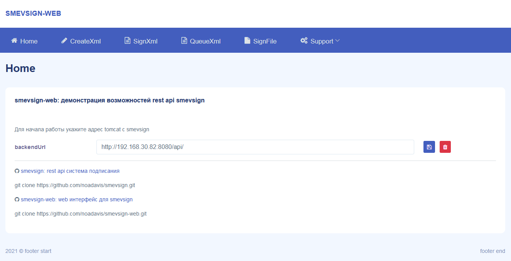

### smevsign-web, vue3: Демонстрация rest api сервиса smevsign: формирования и подписания xml для СМЭВ3 [ https://github.com/noadavis/smevsign ]

[](#title)

### Для запуска проекта нет необходимости устанавливать nodejs и зависимости, достаточно запустить index.html из папки dist, проект готов к работе в firefox.

### Установка зависимостей
```
npm install
```

### Запуск в режиме разработки
```
npm run serve
```

### Сборка проекта для публикации, в папку dist
```
npm run build
```

### Bootstrap 5 theme
Mazer: https://github.com/zuramai/mazer